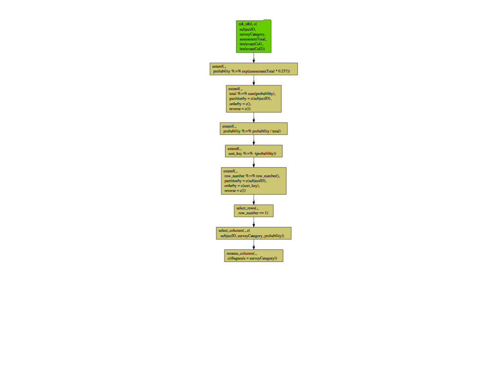

Build Diagram
================

``` r
library(yaml)
library(wrapr)
library(rquery)
library(rqdatatable)
source('R_fns.R')  # https://github.com/WinVector/data_algebra/blob/master/Examples/LogisticExample/R_fns.R

r_yaml <- yaml.load_file("pipeline_yaml.txt")
r_ops <- convert_yaml_to_pipeline(r_yaml)
cat(format(r_ops))
```

    ## table(d; 
    ##   subjectID,
    ##   surveyCategory,
    ##   assessmentTotal) %.>%
    ##  extend(.,
    ##   probability := exp(assessmentTotal * 0.237)) %.>%
    ##  extend(.,
    ##   total := sum(probability),
    ##   p= subjectID) %.>%
    ##  extend(.,
    ##   probability := probability / total) %.>%
    ##  extend(.,
    ##   sort_key := -(1) * probability) %.>%
    ##  extend(.,
    ##   row_number := row_number(),
    ##   p= subjectID,
    ##   o= "sort_key") %.>%
    ##  select_rows(.,
    ##    row_number == 1) %.>%
    ##  select_columns(.,
    ##    subjectID, surveyCategory, probability)

``` r
r_ops %.>%
  op_diagram(.) %.>% 
  DiagrammeR::grViz(.)
```

<!-- -->

See also <https://github.com/WinVector/rquery/tree/master/Examples/yaml>
.
