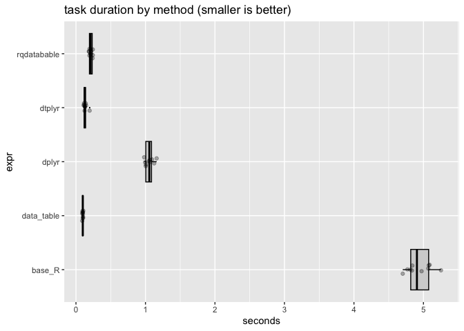

TimedGroupCalc
================
2022-12-13

In this note compare a simple grouped calculation in Python using [base
R](https://www.r-project.org), [data
table](https://CRAN.R-project.org/package=data.table),
[dplyr](https://CRAN.R-project.org/package=dplyr), and
[rqdatatable](https://CRAN.R-project.org/package=rqdatatable).

For similar timing in Python, please see
[here](https://github.com/WinVector/data_algebra/blob/main/Examples/Polars/TimeGroupedCalc.ipynb).

``` r
library(microbenchmark)
library(dplyr)
```

    ## 
    ## Attaching package: 'dplyr'

    ## The following objects are masked from 'package:stats':
    ## 
    ##     filter, lag

    ## The following objects are masked from 'package:base':
    ## 
    ##     intersect, setdiff, setequal, union

``` r
library(dtplyr)
library(rqdatatable)
```

    ## Loading required package: wrapr

    ## 
    ## Attaching package: 'wrapr'

    ## The following object is masked from 'package:dplyr':
    ## 
    ##     coalesce

    ## Loading required package: rquery

``` r
library(data.table)
```

    ## 
    ## Attaching package: 'data.table'

    ## The following object is masked from 'package:wrapr':
    ## 
    ##     :=

    ## The following objects are masked from 'package:dplyr':
    ## 
    ##     between, first, last

``` r
set.seed(2022)
```

``` r
mk_example <- function(n_rows, n_groups) {
  groups <- vapply(seq(n_groups), function(x) paste0("group_", x), character(1))
  data.frame(
    group = sample(groups, size = n_rows, replace = TRUE),
    value = rnorm(n_rows))
}
```

``` r
d <- mk_example(10, 2)
```

``` r
base_r_fn <- function(d) {
  agg_max <- aggregate(value ~ group, d, FUN=max)
  colnames(agg_max) <- c("value", "max_value")
  agg_min <- aggregate(value ~ group, d, FUN=min)
  colnames(agg_min) <- c("value", "min_value")
  merge(agg_min, agg_max)
}
```

``` r
base_r_fn(d)
```

    ##     value min_value max_value
    ## 1 group_1 -1.059256 0.7494859
    ## 2 group_2 -2.900629 1.0061857

``` r
d_tibble <- tibble(d)
d_data_table <- data.table(d)
```

Show a few matching examples.

``` r
data_table_fn <- function(d_data_table) {
  d_data_table[, .(min_value = min(value), max_value = max(value)), by = group]
}
```

``` r
data_table_fn(d_data_table)
```

    ##      group min_value max_value
    ## 1: group_2 -2.900629 1.0061857
    ## 2: group_1 -1.059256 0.7494859

``` r
dplyr_fn <- function(d_tibble) {
  d_tibble |>
    group_by(group) |>
    summarize(
      min_value = min(value),
      max_value = max(value)
    ) |>
    ungroup()
}
```

``` r
dplyr_fn(d_tibble)
```

    ## # A tibble: 2 × 3
    ##   group   min_value max_value
    ##   <chr>       <dbl>     <dbl>
    ## 1 group_1     -1.06     0.749
    ## 2 group_2     -2.90     1.01

``` r
dtplyr_fn <- function(d_tibble) {
  lazy_dt(d_tibble) |>
    group_by(group) |>
    summarize(
      min_value = min(value),
      max_value = max(value)
    ) |>
    ungroup() |>
    as_tibble()
}
```

``` r
dtplyr_fn(d_tibble)
```

    ## # A tibble: 2 × 3
    ##   group   min_value max_value
    ##   <chr>       <dbl>     <dbl>
    ## 1 group_1     -1.06     0.749
    ## 2 group_2     -2.90     1.01

``` r
rqdatatable_fn <- function(d_data_table) {
  ops <- local_td(d_data_table, name = "d_data_table") |>
    project(groupby = "group", 
            min_value := min(value),
            max_value := max(value))
  d_data_table %.>% ops
}
```

``` r
rqdatatable_fn(d)
```

    ##     group min_value max_value
    ## 1 group_2 -2.900629 1.0061857
    ## 2 group_1 -1.059256 0.7494859

Time a larger example.

``` r
d <- mk_example(n_rows=1000000, n_groups=100000)
d_tibble <- tibble(d)
d_data_table <- data.table(d)
n_repetitions <- 10L
```

``` r
timings <- microbenchmark(
  base_R = nrow(base_r_fn(d)),
  data_table = nrow(data_table_fn(d_data_table)),
  dplyr = nrow(dplyr_fn(d_tibble)),
  dtplyr = nrow(dtplyr_fn(d_tibble)),
  rqdatabable = nrow(rqdatatable_fn(d_data_table)),
  times = n_repetitions
)
```

``` r
print(timings, unit="s")
```

    ## Unit: seconds
    ##         expr        min         lq       mean     median        uq       max
    ##       base_R 4.70199419 4.81126104 4.94173607 4.90616173 5.0767859 5.2527458
    ##   data_table 0.09002466 0.09263841 0.09780879 0.09894274 0.1006140 0.1053476
    ##        dplyr 0.98075563 1.00402095 1.05419643 1.05555202 1.0946687 1.1609567
    ##       dtplyr 0.11150974 0.11619267 0.13322460 0.12710622 0.1399637 0.1967556
    ##  rqdatabable 0.18579404 0.19347639 0.21254264 0.21093781 0.2389501 0.2425832
    ##  neval
    ##     10
    ##     10
    ##     10
    ##     10
    ##     10

``` r
timing_frame <- as.data.frame(timings)
timing_frame$seconds <- timings$time/1e+9

WVPlots::ScatterBoxPlotH(
  timing_frame,
  xvar = "seconds",
  yvar = "expr",
  title = "task duration by method (smaller is better)"
)
```

<!-- -->

``` r
# save summary
summary_frame <- aggregate(seconds ~ expr, timing_frame, FUN=mean)
colnames(summary_frame) <- c("method", "time (seconds/run)")
summary_frame["language"] <- "R"
write.csv(summary_frame, "tgc_r_summary.csv", row.names = FALSE) 
```

``` r
R.Version()$version.string
```

    ## [1] "R version 4.2.2 (2022-10-31)"

``` r
pkgs <- data.frame(
  pkg = c("dplyr", "dtplyr", "data.table", "rqdatatable")
)
pkgs$version = vapply(
  pkgs$pkg, 
  function(p) as.character(packageVersion(p)),
  character(1))

knitr::kable(pkgs)
```

| pkg         | version |
|:------------|:--------|
| dplyr       | 1.0.10  |
| dtplyr      | 1.2.2   |
| data.table  | 1.14.6  |
| rqdatatable | 1.3.1   |
