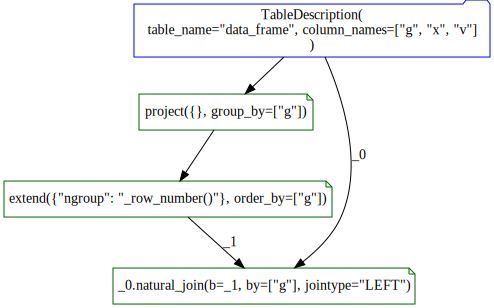

The [data_algebra](https://github.com/WinVector/data_algebra) provides a simplified (though verbose) unified interface to Pandas and SQL windows functions.

Let's work an example. First bring in our packages.


```python
import sqlite3
import pandas

from data_algebra.data_ops import *  # https://github.com/WinVector/data_algebra
import data_algebra.util
import data_algebra.SQLite
```

Now some example data.


```python
d = pandas.DataFrame({
    'g': [1, 2, 2, 3, 3, 3],
    'x': [1, 4, 5, 7, 8, 9],
    'v': [10, 40, 50, 70, 80, 90],
})
```

And we can run a number of ordered and un-ordered window functions (the distinction is given by if ther is an `order_by` argument present).


```python
table_desciption = describe_table(d)

ops = table_desciption. \
    extend({
        'row_number': '_row_number()',
        'shift_v': 'v.shift()',
    },
    order_by=['x'],
    partition_by=['g']). \
    extend({
        'ngroup': '_ngroup()',
        'size': '_size()',
        'max_v': 'v.max()',
        'min_v': 'v.min()',
        'sum_v': 'v.sum()',
        'mean_v': 'v.mean()',
        'count_v': 'v.count()',
        'size_v': 'v.size()',
    },
    partition_by=['g'])

res1 = ops.transform(d)

res1
```


<div>
<style scoped>
    .dataframe tbody tr th:only-of-type {
        vertical-align: middle;
    }

    .dataframe tbody tr th {
        vertical-align: top;
    }

    .dataframe thead th {
        text-align: right;
    }
</style>
<table border="1" class="dataframe">
  <thead>
    <tr style="text-align: right;">
      <th></th>
      <th>g</th>
      <th>x</th>
      <th>v</th>
      <th>row_number</th>
      <th>shift_v</th>
      <th>ngroup</th>
      <th>size</th>
      <th>max_v</th>
      <th>min_v</th>
      <th>sum_v</th>
      <th>mean_v</th>
      <th>count_v</th>
      <th>size_v</th>
    </tr>
  </thead>
  <tbody>
    <tr>
      <th>0</th>
      <td>1</td>
      <td>1</td>
      <td>10</td>
      <td>1</td>
      <td>NaN</td>
      <td>0</td>
      <td>1</td>
      <td>10</td>
      <td>10</td>
      <td>10</td>
      <td>10</td>
      <td>1</td>
      <td>1</td>
    </tr>
    <tr>
      <th>1</th>
      <td>2</td>
      <td>4</td>
      <td>40</td>
      <td>1</td>
      <td>NaN</td>
      <td>1</td>
      <td>2</td>
      <td>50</td>
      <td>40</td>
      <td>90</td>
      <td>45</td>
      <td>2</td>
      <td>2</td>
    </tr>
    <tr>
      <th>2</th>
      <td>2</td>
      <td>5</td>
      <td>50</td>
      <td>2</td>
      <td>40.0</td>
      <td>1</td>
      <td>2</td>
      <td>50</td>
      <td>40</td>
      <td>90</td>
      <td>45</td>
      <td>2</td>
      <td>2</td>
    </tr>
    <tr>
      <th>3</th>
      <td>3</td>
      <td>7</td>
      <td>70</td>
      <td>1</td>
      <td>NaN</td>
      <td>2</td>
      <td>3</td>
      <td>90</td>
      <td>70</td>
      <td>240</td>
      <td>80</td>
      <td>3</td>
      <td>3</td>
    </tr>
    <tr>
      <th>4</th>
      <td>3</td>
      <td>8</td>
      <td>80</td>
      <td>2</td>
      <td>70.0</td>
      <td>2</td>
      <td>3</td>
      <td>90</td>
      <td>70</td>
      <td>240</td>
      <td>80</td>
      <td>3</td>
      <td>3</td>
    </tr>
    <tr>
      <th>5</th>
      <td>3</td>
      <td>9</td>
      <td>90</td>
      <td>3</td>
      <td>80.0</td>
      <td>2</td>
      <td>3</td>
      <td>90</td>
      <td>70</td>
      <td>240</td>
      <td>80</td>
      <td>3</td>
      <td>3</td>
    </tr>
  </tbody>
</table>
</div>


One of the benefits of the data_algebra is the commands are saved in an object.


```python
print(ops.to_python(pretty=True))
```

    TableDescription(table_name="data_frame", column_names=["g", "x", "v"]
    ).extend(
        {"row_number": "_row_number()", "shift_v": "v.shift()"},
        partition_by=["g"],
        order_by=["x"],
    ).extend(
        {
            "ngroup": "_ngroup()",
            "size": "_size()",
            "max_v": "v.max()",
            "min_v": "v.min()",
            "sum_v": "v.sum()",
            "mean_v": "v.mean()",
            "count_v": "v.count()",
            "size_v": "v.size()",
        },
        partition_by=["g"],
    )
    


And thiese commands can be re-used and even exported to SQL (including large scale SQL such as PostgreSQL, Apache Spark, or Google Big Query).

For a simple demonstration we will use small-scale SQL as realized in SQLite.


```python
conn = sqlite3.connect(":memory:")
db_model = data_algebra.SQLite.SQLiteModel()
db_model.prepare_connection(conn)

ops_db = table_desciption. \
    extend({
        'row_number': '_row_number()',
        'shift_v': 'v.shift()',
    },
    order_by=['x'],
    partition_by=['g']). \
    extend({
        # 'ngroup': '_ngroup()',
        'size': '_size()',
        'max_v': 'v.max()',
        'min_v': 'v.min()',
        'sum_v': 'v.sum()',
        'mean_v': 'v.mean()',
        'count_v': 'v.count()',
        'size_v': 'v.size()',
    },
    partition_by=['g'])

db_model.insert_table(conn, d, table_desciption.table_name)
sql1 = ops_db.to_sql(db_model, pretty=True)

print(sql1)
```

    SELECT "g",
           "x",
           "v",
           "row_number",
           "shift_v",
           SUM(1) OVER (PARTITION BY "g") AS "size",
                       MAX("v") OVER (PARTITION BY "g") AS "max_v",
                                     MIN("v") OVER (PARTITION BY "g") AS "min_v",
                                                   SUM("v") OVER (PARTITION BY "g") AS "sum_v",
                                                                 avg("v") OVER (PARTITION BY "g") AS "mean_v",
                                                                               COUNT("v") OVER (PARTITION BY "g") AS "count_v",
                                                                                               SUM(1) OVER (PARTITION BY "g") AS "size_v"
    FROM
      (SELECT "g",
              "x",
              "v",
              ROW_NUMBER() OVER (PARTITION BY "g"
                                 ORDER BY "x") AS "row_number",
                                LAG("v") OVER (PARTITION BY "g"
                                               ORDER BY "x") AS "shift_v"
       FROM ("data_frame") "SQ_0") "SQ_1"


And we can execute this SQL either to materialize a remote result (which involves no data motion, as we send the SQL commands to the database, not move the data to/from Python), or to bring a result back from the database to Python.


```python
res1_db = db_model.read_query(conn, sql1)

res1_db
```


<div>
<style scoped>
    .dataframe tbody tr th:only-of-type {
        vertical-align: middle;
    }

    .dataframe tbody tr th {
        vertical-align: top;
    }

    .dataframe thead th {
        text-align: right;
    }
</style>
<table border="1" class="dataframe">
  <thead>
    <tr style="text-align: right;">
      <th></th>
      <th>g</th>
      <th>x</th>
      <th>v</th>
      <th>row_number</th>
      <th>shift_v</th>
      <th>size</th>
      <th>max_v</th>
      <th>min_v</th>
      <th>sum_v</th>
      <th>mean_v</th>
      <th>count_v</th>
      <th>size_v</th>
    </tr>
  </thead>
  <tbody>
    <tr>
      <th>0</th>
      <td>1</td>
      <td>1</td>
      <td>10</td>
      <td>1</td>
      <td>NaN</td>
      <td>1</td>
      <td>10</td>
      <td>10</td>
      <td>10</td>
      <td>10.0</td>
      <td>1</td>
      <td>1</td>
    </tr>
    <tr>
      <th>1</th>
      <td>2</td>
      <td>4</td>
      <td>40</td>
      <td>1</td>
      <td>NaN</td>
      <td>2</td>
      <td>50</td>
      <td>40</td>
      <td>90</td>
      <td>45.0</td>
      <td>2</td>
      <td>2</td>
    </tr>
    <tr>
      <th>2</th>
      <td>2</td>
      <td>5</td>
      <td>50</td>
      <td>2</td>
      <td>40.0</td>
      <td>2</td>
      <td>50</td>
      <td>40</td>
      <td>90</td>
      <td>45.0</td>
      <td>2</td>
      <td>2</td>
    </tr>
    <tr>
      <th>3</th>
      <td>3</td>
      <td>7</td>
      <td>70</td>
      <td>1</td>
      <td>NaN</td>
      <td>3</td>
      <td>90</td>
      <td>70</td>
      <td>240</td>
      <td>80.0</td>
      <td>3</td>
      <td>3</td>
    </tr>
    <tr>
      <th>4</th>
      <td>3</td>
      <td>8</td>
      <td>80</td>
      <td>2</td>
      <td>70.0</td>
      <td>3</td>
      <td>90</td>
      <td>70</td>
      <td>240</td>
      <td>80.0</td>
      <td>3</td>
      <td>3</td>
    </tr>
    <tr>
      <th>5</th>
      <td>3</td>
      <td>9</td>
      <td>90</td>
      <td>3</td>
      <td>80.0</td>
      <td>3</td>
      <td>90</td>
      <td>70</td>
      <td>240</td>
      <td>80.0</td>
      <td>3</td>
      <td>3</td>
    </tr>
  </tbody>
</table>
</div>


Notice we didn't calculate the group-id `rgroup` in the `SQL` version.  This is because this is a much less common window function (and not often used in applications). This is also only interesting when we are using a composite key (else the single key column is already the per-group id). So not all data_algebra pipelines can run in all environments. However, we can compute (arbitrary) group IDs in a domain independent manner as follows.


```python
id_ops_a = table_desciption. \
    project(group_by=['g']). \
    extend({
        'ngroup': '_row_number()',
    },
    order_by=['g'])

id_ops_b = table_desciption. \
    natural_join(id_ops_a, by=['g'], jointype='LEFT')

print(id_ops_b.to_python(pretty=True))
```

    TableDescription(table_name="data_frame", column_names=["g", "x", "v"]
    ).natural_join(
        b=TableDescription(table_name="data_frame", column_names=["g", "x", "v"])
        .project({}, group_by=["g"])
        .extend({"ngroup": "_row_number()"}, order_by=["g"]),
        by=["g"],
        jointype="LEFT",
    )
    


```python
sql2 = id_ops_b.to_sql(db_model)

cur = conn.cursor()
cur.execute('CREATE TABLE remote_result AS ' + sql2)
```


    <sqlite3.Cursor at 0x31e617ea0>


```python
res2_db = db_model.read_table(conn, 'remote_result')

res2_db
```


<div>
<style scoped>
    .dataframe tbody tr th:only-of-type {
        vertical-align: middle;
    }

    .dataframe tbody tr th {
        vertical-align: top;
    }

    .dataframe thead th {
        text-align: right;
    }
</style>
<table border="1" class="dataframe">
  <thead>
    <tr style="text-align: right;">
      <th></th>
      <th>g</th>
      <th>x</th>
      <th>v</th>
      <th>ngroup</th>
    </tr>
  </thead>
  <tbody>
    <tr>
      <th>0</th>
      <td>1</td>
      <td>1</td>
      <td>10</td>
      <td>1</td>
    </tr>
    <tr>
      <th>1</th>
      <td>2</td>
      <td>4</td>
      <td>40</td>
      <td>2</td>
    </tr>
    <tr>
      <th>2</th>
      <td>2</td>
      <td>5</td>
      <td>50</td>
      <td>2</td>
    </tr>
    <tr>
      <th>3</th>
      <td>3</td>
      <td>7</td>
      <td>70</td>
      <td>3</td>
    </tr>
    <tr>
      <th>4</th>
      <td>3</td>
      <td>8</td>
      <td>80</td>
      <td>3</td>
    </tr>
    <tr>
      <th>5</th>
      <td>3</td>
      <td>9</td>
      <td>90</td>
      <td>3</td>
    </tr>
  </tbody>
</table>
</div>


And we can execute the same pipeline in Pandas.


```python
id_ops_b.transform(d)
```


<div>
<style scoped>
    .dataframe tbody tr th:only-of-type {
        vertical-align: middle;
    }

    .dataframe tbody tr th {
        vertical-align: top;
    }

    .dataframe thead th {
        text-align: right;
    }
</style>
<table border="1" class="dataframe">
  <thead>
    <tr style="text-align: right;">
      <th></th>
      <th>g</th>
      <th>x</th>
      <th>v</th>
      <th>ngroup</th>
    </tr>
  </thead>
  <tbody>
    <tr>
      <th>0</th>
      <td>1</td>
      <td>1</td>
      <td>10</td>
      <td>1</td>
    </tr>
    <tr>
      <th>1</th>
      <td>2</td>
      <td>4</td>
      <td>40</td>
      <td>2</td>
    </tr>
    <tr>
      <th>2</th>
      <td>2</td>
      <td>5</td>
      <td>50</td>
      <td>2</td>
    </tr>
    <tr>
      <th>3</th>
      <td>3</td>
      <td>7</td>
      <td>70</td>
      <td>3</td>
    </tr>
    <tr>
      <th>4</th>
      <td>3</td>
      <td>8</td>
      <td>80</td>
      <td>3</td>
    </tr>
    <tr>
      <th>5</th>
      <td>3</td>
      <td>9</td>
      <td>90</td>
      <td>3</td>
    </tr>
  </tbody>
</table>
</div>


And we can diagram the group labeling operation.


```python
import graphviz

import data_algebra.diagram

dot = data_algebra.diagram.to_digraph(id_ops_b)
dot
```





Or all the steps in one sequence.


```python
all_ops = id_ops_b. \
    extend({
        'row_number': '_row_number()',
        'shift_v': 'v.shift()',
    },
    order_by=['x'],
    partition_by=['g']). \
    extend({
        'size': '_size()',
        'max_v': 'v.max()',
        'min_v': 'v.min()',
        'sum_v': 'v.sum()',
        'mean_v': 'v.mean()',
        'count_v': 'v.count()',
        'size_v': 'v.size()',
    },
    partition_by=['g'])

dot = data_algebra.diagram.to_digraph(all_ops)
dot
```


```python
all_ops.transform(d)
```


<div>
<style scoped>
    .dataframe tbody tr th:only-of-type {
        vertical-align: middle;
    }

    .dataframe tbody tr th {
        vertical-align: top;
    }

    .dataframe thead th {
        text-align: right;
    }
</style>
<table border="1" class="dataframe">
  <thead>
    <tr style="text-align: right;">
      <th></th>
      <th>g</th>
      <th>x</th>
      <th>v</th>
      <th>ngroup</th>
      <th>row_number</th>
      <th>shift_v</th>
      <th>size</th>
      <th>max_v</th>
      <th>min_v</th>
      <th>sum_v</th>
      <th>mean_v</th>
      <th>count_v</th>
      <th>size_v</th>
    </tr>
  </thead>
  <tbody>
    <tr>
      <th>0</th>
      <td>1</td>
      <td>1</td>
      <td>10</td>
      <td>1</td>
      <td>1</td>
      <td>NaN</td>
      <td>1</td>
      <td>10</td>
      <td>10</td>
      <td>10</td>
      <td>10</td>
      <td>1</td>
      <td>1</td>
    </tr>
    <tr>
      <th>1</th>
      <td>2</td>
      <td>4</td>
      <td>40</td>
      <td>2</td>
      <td>1</td>
      <td>NaN</td>
      <td>2</td>
      <td>50</td>
      <td>40</td>
      <td>90</td>
      <td>45</td>
      <td>2</td>
      <td>2</td>
    </tr>
    <tr>
      <th>2</th>
      <td>2</td>
      <td>5</td>
      <td>50</td>
      <td>2</td>
      <td>2</td>
      <td>40.0</td>
      <td>2</td>
      <td>50</td>
      <td>40</td>
      <td>90</td>
      <td>45</td>
      <td>2</td>
      <td>2</td>
    </tr>
    <tr>
      <th>3</th>
      <td>3</td>
      <td>7</td>
      <td>70</td>
      <td>3</td>
      <td>1</td>
      <td>NaN</td>
      <td>3</td>
      <td>90</td>
      <td>70</td>
      <td>240</td>
      <td>80</td>
      <td>3</td>
      <td>3</td>
    </tr>
    <tr>
      <th>4</th>
      <td>3</td>
      <td>8</td>
      <td>80</td>
      <td>3</td>
      <td>2</td>
      <td>70.0</td>
      <td>3</td>
      <td>90</td>
      <td>70</td>
      <td>240</td>
      <td>80</td>
      <td>3</td>
      <td>3</td>
    </tr>
    <tr>
      <th>5</th>
      <td>3</td>
      <td>9</td>
      <td>90</td>
      <td>3</td>
      <td>3</td>
      <td>80.0</td>
      <td>3</td>
      <td>90</td>
      <td>70</td>
      <td>240</td>
      <td>80</td>
      <td>3</td>
      <td>3</td>
    </tr>
  </tbody>
</table>
</div>


```python
db_model.read_query(conn, all_ops.to_sql(db_model))
```


<div>
<style scoped>
    .dataframe tbody tr th:only-of-type {
        vertical-align: middle;
    }

    .dataframe tbody tr th {
        vertical-align: top;
    }

    .dataframe thead th {
        text-align: right;
    }
</style>
<table border="1" class="dataframe">
  <thead>
    <tr style="text-align: right;">
      <th></th>
      <th>g</th>
      <th>x</th>
      <th>v</th>
      <th>ngroup</th>
      <th>row_number</th>
      <th>shift_v</th>
      <th>size</th>
      <th>max_v</th>
      <th>min_v</th>
      <th>sum_v</th>
      <th>mean_v</th>
      <th>count_v</th>
      <th>size_v</th>
    </tr>
  </thead>
  <tbody>
    <tr>
      <th>0</th>
      <td>1</td>
      <td>1</td>
      <td>10</td>
      <td>1</td>
      <td>1</td>
      <td>NaN</td>
      <td>1</td>
      <td>10</td>
      <td>10</td>
      <td>10</td>
      <td>10.0</td>
      <td>1</td>
      <td>1</td>
    </tr>
    <tr>
      <th>1</th>
      <td>2</td>
      <td>4</td>
      <td>40</td>
      <td>2</td>
      <td>1</td>
      <td>NaN</td>
      <td>2</td>
      <td>50</td>
      <td>40</td>
      <td>90</td>
      <td>45.0</td>
      <td>2</td>
      <td>2</td>
    </tr>
    <tr>
      <th>2</th>
      <td>2</td>
      <td>5</td>
      <td>50</td>
      <td>2</td>
      <td>2</td>
      <td>40.0</td>
      <td>2</td>
      <td>50</td>
      <td>40</td>
      <td>90</td>
      <td>45.0</td>
      <td>2</td>
      <td>2</td>
    </tr>
    <tr>
      <th>3</th>
      <td>3</td>
      <td>7</td>
      <td>70</td>
      <td>3</td>
      <td>1</td>
      <td>NaN</td>
      <td>3</td>
      <td>90</td>
      <td>70</td>
      <td>240</td>
      <td>80.0</td>
      <td>3</td>
      <td>3</td>
    </tr>
    <tr>
      <th>4</th>
      <td>3</td>
      <td>8</td>
      <td>80</td>
      <td>3</td>
      <td>2</td>
      <td>70.0</td>
      <td>3</td>
      <td>90</td>
      <td>70</td>
      <td>240</td>
      <td>80.0</td>
      <td>3</td>
      <td>3</td>
    </tr>
    <tr>
      <th>5</th>
      <td>3</td>
      <td>9</td>
      <td>90</td>
      <td>3</td>
      <td>3</td>
      <td>80.0</td>
      <td>3</td>
      <td>90</td>
      <td>70</td>
      <td>240</td>
      <td>80.0</td>
      <td>3</td>
      <td>3</td>
    </tr>
  </tbody>
</table>
</div>


```python
# clean up
conn.close()
```
