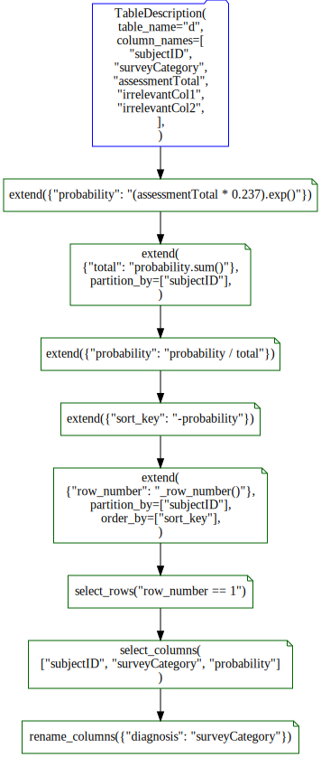

# data_algebra

[Codd style operators](https://en.wikipedia.org/wiki/Relational_algebra) in a [piped](https://en.wikipedia.org/wiki/Pipeline_(Unix)) or [method-chained](https://en.wikipedia.org/wiki/Method_chaining) notation (or [dplyr](https://CRAN.R-project.org/package=dplyr)-esque) data processing in Python


[This](https://github.com/WinVector/data_algebra) is to be the [`Python`](https://www.python.org) equivalent of the [`R`](https://www.r-project.org) packages [`rquery`](https://github.com/WinVector/rquery/) and [`rqdatatable`](https://github.com/WinVector/rqdatatable).  This package will supply piped Codd-transform style notation that 
can perform data engineering in [`Pandas`](https://pandas.pydata.org) and generate [`SQL`](https://en.wikipedia.org/wiki/SQL) queries from the same specification.


# Installing

Install `data_algebra` with either of:

  * `pip install data_algebra`
  * `pip install https://github.com/WinVector/data_algebra/raw/master/dist/data_algebra-0.3.0.tar.gz`

# Announcement


This article introduces the [`data_algebra`](https://github.com/WinVector/data_algebra) project: a data processing tool family available in `R` and `Python`.  These tools are designed to transform data either in-memory or on remote databases.  

In particular we will discuss the `Python` implementation (also called `data_algebra`) and its relation to the mature `R` implementations (`rquery` and `rqdatatable`).

## Introduction

The project intent is to realize a method chained data processing language based on [Codd's relational operators](https://en.wikipedia.org/wiki/Relational_model) that is easy to maintain, has helpful tooling, and has very similar realizations (or dialects) for:

  * [`SQL`](https://en.wikipedia.org/wiki/SQL) databases accessed from [`Python`](https://www.python.org), useful working at scale with `PostgreSQL` or Apache `Spark` (`Spark` example [here](https://github.com/WinVector/data_algebra/blob/master/Examples/Spark/pyspark_example.ipynb)).
  * [`Pandas`](https://pandas.pydata.org) `DataFrame` objects in `Python`.
  * [`dask`](https://dask.org) distributed `Pandas` structures.
  * `SQL` databases access from [`R`](https://www.r-project.org) (implementation is [here](https://github.com/WinVector/rquery), and is mature and ready for production use).
  * [`data.table`](http://r-datatable.com) objects in `R` (implementation is [here](https://github.com/WinVector/rqdatatable), and is mature and ready for production use).
  
The intent is the notation should look idiomatic in each language.  Working in `Python` should feel like working in `Python`, and working in `R` should feel like working in `R`.  The data semantics, however, are designed to be close to the `SQL` realizations (given the close connection of `SQL` to the relational algebra; in particular row numbering starts at `1` and row and column order is not preserved except at row-order steps or select-columns steps respectively). The intent is: it should be very easy to use the system in either `Python` or `R` (a boon to multi-language data science projects) and it is easy to port either code or experience from one system to another (a boon for porting projects, or for data scientists working with more than one code base or computer language).

Related work includes:

  * [Codd's relational algebra](https://en.wikipedia.org/wiki/Relational_algebra)
  * [`SQL`](https://en.wikipedia.org/wiki/SQL)
  * [`data.table`](https://CRAN.R-project.org/package=data.table)
  * [`LINQ`](https://en.wikipedia.org/wiki/Language_Integrated_Query)
  * [`dplyr`](https://CRAN.R-project.org/package=dplyr)
  * [`dtplyr`](https://CRAN.R-project.org/package=dtplyr)
  * [`table.express`](https://github.com/asardaes/table.express)
  * [`Pandas`](https://pandas.pydata.org)
  * [`SQLAlchemy`](https://www.sqlalchemy.org)
  * [`rquery`](https://github.com/WinVector/rquery/)
  * [`cdata`](https://github.com/WinVector/cdata/)
  
The `data_algebra` principles include:

  * Writing data transforms as a pipeline or method-chain of many simple transform steps.
  * Treating data transform pipelines or directed acyclic graphs (DAGs) as themselves being sharable data.
  * Being able to use the same transform specification many places (in memory, on databases, in `R`, in `Python`).

The `data_algebra` supplies two primary services:

  * Building composite data processing pipelines (which we demonstrate in this note).
  * Building record transforms (which we demonstrate [here](https://github.com/WinVector/data_algebra/blob/master/Examples/cdata/cdata_general_example.ipynb)).

## Example

Let's start with a pipeline example in `Python` (for a record transform example, please see [here](https://github.com/WinVector/data_algebra/blob/master/Examples/cdata/cdata_general_example.ipynb)).

For our example we will assume we have a data set of how many points different subjects score in a psychological survey.  The goal is transform the data so that we see what fraction of the subjects answers are in each category (subject to an exponential transform, as often used in [logistic regression](https://en.wikipedia.org/wiki/Logistic_regression)).  We then treat the per-subject renormalized data as a probabilty or diagnosis.

The exact meaning of such a scoring method are not the topic of this note.  It is a notional example to show a non-trivial data transformation need.  In particular: having to normalize per-subject (divide some set of scores per-subject by a per-subject total) is a classic pain point in data-processing.  In classic `SQL` this can only be done by joining against a summary table, or in more modern `SQL` with a "[window function](https://en.wikipedia.org/wiki/SQL_window_function)." We want to show by working in small enough steps this can be done simply.

### Set up

Let's start our `Python` example.  First we import the packages we are going to use, and set a few options.


```python
import math
import io
import sqlite3
from pprint import pprint
import psycopg2       # http://initd.org/psycopg/
import pandas         # https://pandas.pydata.org
import yaml           # https://pyyaml.org
from data_algebra.data_ops import *  # https://github.com/WinVector/data_algebra
import data_algebra.env
import data_algebra.yaml
import data_algebra.PostgreSQL
import data_algebra.SQLite

# ask YAML to write simpler structures
data_algebra.yaml.fix_ordered_dict_yaml_rep()

pandas.set_option('display.max_columns', None)  
pandas.set_option('display.expand_frame_repr', False)
pandas.set_option('max_colwidth', -1)
```

Now let's type in our example data.  Notice this is an in-memory `Pandas` `Data.Frame`.


```python
d_local = pandas.DataFrame({
    'subjectID':[1, 1, 2, 2],
    'surveyCategory': [ "withdrawal behavior", "positive re-framing", "withdrawal behavior", "positive re-framing"],
    'assessmentTotal': [5, 2, 3, 4],
    'irrelevantCol1': ['irrel1']*4,
    'irrelevantCol2': ['irrel2']*4,
})
d_local
```


<div>

<table border="1" class="dataframe">
  <thead>
    <tr style="text-align: right;">
      <th></th>
      <th>subjectID</th>
      <th>surveyCategory</th>
      <th>assessmentTotal</th>
      <th>irrelevantCol1</th>
      <th>irrelevantCol2</th>
    </tr>
  </thead>
  <tbody>
    <tr>
      <th>0</th>
      <td>1</td>
      <td>withdrawal behavior</td>
      <td>5</td>
      <td>irrel1</td>
      <td>irrel2</td>
    </tr>
    <tr>
      <th>1</th>
      <td>1</td>
      <td>positive re-framing</td>
      <td>2</td>
      <td>irrel1</td>
      <td>irrel2</td>
    </tr>
    <tr>
      <th>2</th>
      <td>2</td>
      <td>withdrawal behavior</td>
      <td>3</td>
      <td>irrel1</td>
      <td>irrel2</td>
    </tr>
    <tr>
      <th>3</th>
      <td>2</td>
      <td>positive re-framing</td>
      <td>4</td>
      <td>irrel1</td>
      <td>irrel2</td>
    </tr>
  </tbody>
</table>
</div>


Let's also copy this data to a [`PostgreSQL`](https://www.postgresql.org) database.  Normally big data is already in the system one wants to work with, so the copying over is just to simulate the data already being there.


```python
use_postgresql = True

if use_postgresql:
    conn = psycopg2.connect(
        database="johnmount",
        user="johnmount",
        host="localhost",
        password=""
    )
    conn.autocommit=True
    db_model = data_algebra.PostgreSQL.PostgreSQLModel() 
else:
    conn = sqlite3.connect(':memory:')
    db_model = data_algebra.SQLite.SQLiteModel()

db_model.prepare_connection(conn)  # define any user functions and settings we want/need
```


```python


db_model.insert_table(conn, d_local, 'd')

db_model.read_table(conn, 'd')
```


<div>

<table border="1" class="dataframe">
  <thead>
    <tr style="text-align: right;">
      <th></th>
      <th>subjectid</th>
      <th>surveycategory</th>
      <th>assessmenttotal</th>
      <th>irrelevantcol1</th>
      <th>irrelevantcol2</th>
    </tr>
  </thead>
  <tbody>
    <tr>
      <th>0</th>
      <td>1.0</td>
      <td>withdrawal behavior</td>
      <td>5.0</td>
      <td>irrel1</td>
      <td>irrel2</td>
    </tr>
    <tr>
      <th>1</th>
      <td>1.0</td>
      <td>positive re-framing</td>
      <td>2.0</td>
      <td>irrel1</td>
      <td>irrel2</td>
    </tr>
    <tr>
      <th>2</th>
      <td>2.0</td>
      <td>withdrawal behavior</td>
      <td>3.0</td>
      <td>irrel1</td>
      <td>irrel2</td>
    </tr>
    <tr>
      <th>3</th>
      <td>2.0</td>
      <td>positive re-framing</td>
      <td>4.0</td>
      <td>irrel1</td>
      <td>irrel2</td>
    </tr>
  </tbody>
</table>
</div>


Normally one does not read data back from a database, but instead materializes results in the database with `SQL` commands such as `CREATE TABLE tablename AS SELECT ...`.
Also note: case in columns is a bit of nightmare.  It is often best to lower-case them all.

### Back to the `data_algebra`

Now we continue our example by importing the `data_algebra` components we need.

Now we use the `data_algebra` to define our processing pipeline: `ops`.  We are writing this pipeline using a [method chaining](https://en.wikipedia.org/wiki/Method_chaining) notation where we have placed `Python` method-dot at the end of lines using the `.\` notation.  This notation will look *very* much like a [pipe](https://en.wikipedia.org/wiki/Pipeline_(Unix)) to `R`/[`magrittr`](https://CRAN.R-project.org/package=magrittr) users.


```python
scale = 0.237

with data_algebra.env.Env(locals()) as env:
    ops = data_algebra.data_ops.describe_table(d_local, 'd'). \
        extend({'probability': '(assessmentTotal * scale).exp()'}). \
        extend({'total': 'probability.sum()'},
               partition_by='subjectID'). \
        extend({'probability': 'probability/total'}). \
        extend({'sort_key': '-probability'}). \
        extend({'row_number': '_row_number()'},
               partition_by=['subjectID'],
               order_by=['sort_key']). \
        select_rows('row_number == 1'). \
        select_columns(['subjectID', 'surveyCategory', 'probability']). \
        rename_columns({'diagnosis': 'surveyCategory'})
```

We are deliberately writing a longer pipeline of simple steps, so we can use the same pipeline locally with Pandas, at (potentially) scale with `dask`, and (potentially) great scale with `PostgreSQL` or Apache `Spark`.  A more concise variation of this pipeline can be found in the R example [here](https://github.com/WinVector/rquery).

The intent is: the user can build up very sophisticated processing pipelines using a small number of primitive steps.  The pipelines tend to be long, but can still be very efficient- as they are well suited for use with `Pandas` and with `SQL` query optimizers.  Most of the heavy lifting is performed by the  very powerful "window functions" (triggered by use of `partition_by` and `order_by`) available on the `extend()` step.  Multiple statements can be combined into extend steps, but only when they have the same window-structure, and don't create and use the same value name in the same statement (except for replacement, which is shown in this example).  Many conditions are checked and enforced during pipeline construction, making debugging very easy.

For a more Pythonic way of writing the same pipeline we can show how the code would have been formatted by [`black`](https://github.com/psf/black).


```python
py_source = ops.to_python(pretty=True)
print(py_source)
```

    TableDescription(
        table_name="d",
        column_names=[
            "subjectID",
            "surveyCategory",
            "assessmentTotal",
            "irrelevantCol1",
            "irrelevantCol2",
        ],
    ).extend(
        {"probability": "(assessmentTotal * 0.237).exp()"}
    ).extend(
        {"total": "probability.sum()"}, partition_by=["subjectID"]
    ).extend(
        {"probability": "probability / total"}
    ).extend(
        {"sort_key": "-probability"}
    ).extend(
        {"row_number": "_row_number()"}, partition_by=["subjectID"], order_by=["sort_key"]
    ).select_rows(
        "row_number == 1"
    ).select_columns(
        ["subjectID", "surveyCategory", "probability"]
    ).rename_columns(
        {"diagnosis": "surveyCategory"}
    )
    


In either case, the pipeline is read as a sequence of operations (top to bottom, and left to right).  What it is saying is:

  * We start with a table named "d" that is known to have columns "subjectID", "surveyCategory", "assessmentTotal", "irrelevantCol1", and "irrelevantCol2".
  * We produce a new table by transforming this table through a sequence of "extend" operations which add new columns.
  
    * The first `extend` computes `probability = exp(scale*assessmentTotal)`, this is similar to the inverse-link step of a logistic regression. We assume when writing this pipeline we were given this math as a requirement.
    * The next few `extend` steps total the `probabilty` per-subject (this is controlled by the `partition_by` argument) and then rank the normalized probabilities per-subject (grouping again specified by the `partition_by` argument, and order contolled by the `order_by` clause).
    
  * We then select the per-subject top-ranked rows by the `select_rows` step.
  
  * And finally we clean up the results for presentation with the `select_columns`, `rename_columns`, and `order_rows` steps.  The names of these methods are intedned to evoke what they do.
  
The point is: each step is deliberately so trivial one can reason about it. However the many steps in sequence do quite a lot.

### `SQL`

Once we have the `ops` object we can do quite a lot with it. We have already exhibited the pretty-printing of the pipeline. Next we demonstrate translating the operator pipeline into `SQL`.


```python
sql = ops.to_sql(db_model, pretty=True)
print(sql)
```

    SELECT "subjectid",
           "probability",
           "surveycategory" AS "diagnosis"
    FROM
      (SELECT "subjectid",
              "surveycategory",
              "probability"
       FROM
         (SELECT "subjectid",
                 "surveycategory",
                 "probability"
          FROM
            (SELECT "subjectid",
                    "surveycategory",
                    "probability",
                    "sort_key",
                    ROW_NUMBER() OVER (PARTITION BY "subjectid"
                                       ORDER BY "sort_key") AS "row_number"
             FROM
               (SELECT "subjectid",
                       "surveycategory",
                       "probability",
                       (-"probability") AS "sort_key"
                FROM
                  (SELECT "subjectid",
                          "surveycategory",
                          "probability" / "total" AS "probability"
                   FROM
                     (SELECT "subjectid",
                             "surveycategory",
                             "probability",
                             SUM("probability") OVER (PARTITION BY "subjectid") AS "total"
                      FROM
                        (SELECT "subjectid",
                                "surveycategory",
                                EXP(("assessmenttotal" * 0.237)) AS "probability"
                         FROM
                           (SELECT "subjectid",
                                   "surveycategory",
                                   "assessmenttotal"
                            FROM "d") "sq_0") "sq_1") "sq_2") "sq_3") "sq_4") "sq_5"
          WHERE "row_number" = 1 ) "sq_6") "sq_7"


The `SQL` can be hard to read, as `SQL` expresses composition by inner-nesting (inside `SELECT` statements happen first).  The operator pipeline expresses composition by sequencing or method-chaining, which can be a lot more legible.  However the huge advantage of the `SQL` is: we can send it to the database for execution, as we do now.

Also notice the generate `SQL` has applied query narrowing: columns not used in the outer queries are removed from the inner queries. The "irrelevant" columns are not carried into the calculation as they would be with a `SELECT *`.  This early optimization comes in quite handy.


```python
db_model.read_query(conn, sql)
```


<div>

<table border="1" class="dataframe">
  <thead>
    <tr style="text-align: right;">
      <th></th>
      <th>subjectid</th>
      <th>probability</th>
      <th>diagnosis</th>
    </tr>
  </thead>
  <tbody>
    <tr>
      <th>0</th>
      <td>1.0</td>
      <td>0.670622</td>
      <td>withdrawal behavior</td>
    </tr>
    <tr>
      <th>1</th>
      <td>2.0</td>
      <td>0.558974</td>
      <td>positive re-framing</td>
    </tr>
  </tbody>
</table>
</div>


What comes back is: one row per subject, with the highest per-subject diagnosis and the estimated probabilty. Again, the math of this is outside the scope of this note (think of that as something coming from a specification)- the ability to write such a pipeline is our actual topic.

The hope is that the `data_algebra` pipeline is easier to read, write, and maintain than the `SQL` query. If we wanted to change the calculation we would just add a stage to the `data_algebra` pipeline and then regenerate the `SQL` query.

### `Pandas`

An advantage of the pipeline is it can also be directly used on `Pandas` `DataFrame`s. Let's see how that is achieved.


```python
ops.eval_pandas({'d': d_local})
```


<div>

<table border="1" class="dataframe">
  <thead>
    <tr style="text-align: right;">
      <th></th>
      <th>subjectID</th>
      <th>diagnosis</th>
      <th>probability</th>
    </tr>
  </thead>
  <tbody>
    <tr>
      <th>0</th>
      <td>1</td>
      <td>withdrawal behavior</td>
      <td>0.670622</td>
    </tr>
    <tr>
      <th>1</th>
      <td>2</td>
      <td>positive re-framing</td>
      <td>0.558974</td>
    </tr>
  </tbody>
</table>
</div>


There is also a shorthand notation for single table source pipelines:


```python
ops.transform(d_local)

```


<div>

<table border="1" class="dataframe">
  <thead>
    <tr style="text-align: right;">
      <th></th>
      <th>subjectID</th>
      <th>diagnosis</th>
      <th>probability</th>
    </tr>
  </thead>
  <tbody>
    <tr>
      <th>0</th>
      <td>1</td>
      <td>withdrawal behavior</td>
      <td>0.670622</td>
    </tr>
    <tr>
      <th>1</th>
      <td>2</td>
      <td>positive re-framing</td>
      <td>0.558974</td>
    </tr>
  </tbody>
</table>
</div>


`eval_pandas` takes a dictionary of `Pandas` `DataFrame`s (names matching names specified in the pipeline) and returns the result of applying the pipeline to the data using `Pandas` commands.  Currently our `Pandas` implementation only allows very simple window functions.  This is why we didn't write `probability = probability/sum(probability)`, but instead broken the calculation into multiple steps by introducing the `total` column (the `SQL` realization does in fact support more complex window functions).  This is a small issue with the grammar: but our feeling encourage simple steps is in fact a good thing (improves debuggability), and in `SQL` the query optimizers likely optimize the different query styles into very similar realizations anyway.

### `dask`

We can also apply our transforms to `dask` objects, meaning we can work at a large range of data sizes (`Pandas`, `dask`, `SQL` `PostgreSQL`, and `Apache Spark`).


```python
import dask.dataframe

d_dask = dask.dataframe.from_pandas(d_local, npartitions=2)

res_dask = ops.transform(d_dask)
 
res_dask
```


<div><strong>Dask DataFrame Structure:</strong></div>
<div>

<table border="1" class="dataframe">
  <thead>
    <tr style="text-align: right;">
      <th></th>
      <th>subjectID</th>
      <th>diagnosis</th>
      <th>probability</th>
    </tr>
    <tr>
      <th>npartitions=2</th>
      <th></th>
      <th></th>
      <th></th>
    </tr>
  </thead>
  <tbody>
    <tr>
      <th></th>
      <td>int64</td>
      <td>object</td>
      <td>float64</td>
    </tr>
    <tr>
      <th></th>
      <td>...</td>
      <td>...</td>
      <td>...</td>
    </tr>
    <tr>
      <th></th>
      <td>...</td>
      <td>...</td>
      <td>...</td>
    </tr>
  </tbody>
</table>
</div>
<div>Dask Name: rename, 166 tasks</div>


```python
res_dask.compute()
```


<div>

<table border="1" class="dataframe">
  <thead>
    <tr style="text-align: right;">
      <th></th>
      <th>subjectID</th>
      <th>diagnosis</th>
      <th>probability</th>
    </tr>
  </thead>
  <tbody>
    <tr>
      <th>0</th>
      <td>1</td>
      <td>withdrawal behavior</td>
      <td>0.670622</td>
    </tr>
    <tr>
      <th>0</th>
      <td>2</td>
      <td>positive re-framing</td>
      <td>0.558974</td>
    </tr>
  </tbody>
</table>
</div>


Notice the exact same pipeline can be used in all cases, because all three implementations share a large family of commands.

## Export/Import

Because our operator pipeline is a `Python` object with no references to external objects (such as the database connection), it can be saved through standard methods such as "[pickling](https://docs.python.org/3/library/pickle.html)."

We can also diagram the pipleline using graphviz.


```python
import graphviz

import data_algebra.diagram

dot = data_algebra.diagram.to_digraph(ops)
dot
```





However, `data_algebra` also supports exporting a pipeline to and from simple structures that are in turn optimized for conversion  to [`YAML`](https://yaml.org).  The simple structure format is particularly useful for writing more `data_algebra` tools (such as pipeline analysis and presentation tools).  And the `YAML` tooling makes moving a processing pipeline to another a language (such as `R`) quite easy.

We will demonstrate this next.


```python
# convert pipeline to simple objects
objs_R = ops.collect_representation(dialect='R')
```

In the above data structure the recursive operator steps have been linearized into a list, and simplified to just ordered dictionaries of a few defining and derived fields. In particular, the `key` field of the `TableDescription` nodes is the unique identifier for the tables, two `TableDescription` with the same key are referring to the same table.

We can then write this representation to `YAML` format.


```python
# convert objects to a YAML string
dmp_R = yaml.dump(objs_R)
# write to file
with open("pipeline_yaml.txt", "wt") as f:
    print(dmp_R, file=f)
```

### `R`

This pipeline can be loaded into `R` and used as follows.


```python
%load_ext rpy2.ipython
```


```r
%%R 

library(yaml)
library(wrapr)
library(rquery)
library(rqdatatable)

r_yaml <- yaml.load_file("pipeline_yaml.txt")
r_ops <- convert_yaml_to_pipeline(r_yaml)
cat(format(r_ops))
```

    mk_td("d", c(
      "subjectID",
      "surveyCategory",
      "assessmentTotal",
      "irrelevantCol1",
      "irrelevantCol2")) %.>%
     extend(.,
      probability %:=% exp(assessmentTotal * 0.237)) %.>%
     extend(.,
      total %:=% sum(probability),
      partitionby = c('subjectID'),
      orderby = c(),
      reverse = c()) %.>%
     extend(.,
      probability %:=% probability / total) %.>%
     extend(.,
      sort_key %:=% -(probability)) %.>%
     extend(.,
      row_number %:=% row_number(),
      partitionby = c('subjectID'),
      orderby = c('sort_key'),
      reverse = c()) %.>%
     select_rows(.,
       row_number == 1) %.>%
     select_columns(., c(
       "subjectID", "surveyCategory", "probability")) %.>%
     rename_columns(.,
      c('diagnosis' = 'surveyCategory'))


The above representation is now the equivalent "`R` code", written using [`wrapr` dot pipe](https://journal.r-project.org/archive/2018/RJ-2018-042/index.html)/[`rquery`](https://github.com/WinVector/rquery) notation. The imported pipeline can be directly executed in `R`.


```r
%%R 

d_local <- build_frame(
   "subjectID", "surveyCategory"     , "assessmentTotal", "irrelevantCol1", "irrelevantCol2" |
   1L         , "withdrawal behavior", 5                , "irrel1"        , "irrel2"         |
   1L         , "positive re-framing", 2                , "irrel1"        , "irrel2"         |
   2L         , "withdrawal behavior", 3                , "irrel1"        , "irrel2"         |
   2L         , "positive re-framing", 4                , "irrel1"        , "irrel2"         )

print(d_local)
```

      subjectID      surveyCategory assessmentTotal irrelevantCol1 irrelevantCol2
    1         1 withdrawal behavior               5         irrel1         irrel2
    2         1 positive re-framing               2         irrel1         irrel2
    3         2 withdrawal behavior               3         irrel1         irrel2
    4         2 positive re-framing               4         irrel1         irrel2


We can execute the `R` pipeline using [`data.table`](http://r-datatable.com) by piping data into the `r_ops` object.


```r
%%R 

d_local %.>% 
  r_ops %.>% 
  print(.)
```

       subjectID           diagnosis probability
    1:         1 withdrawal behavior   0.6706221
    2:         2 positive re-framing   0.5589742


And the `R` `rquery` package can also perform its own `SQL` translation (and even execution management).


```r
%%R

sql <- to_sql(r_ops, rquery_default_db_info())
cat(sql)
```

    SELECT
     "subjectID" AS "subjectID",
     "surveyCategory" AS "diagnosis",
     "probability" AS "probability"
    FROM (
     SELECT
      "subjectID",
      "surveyCategory",
      "probability"
     FROM (
      SELECT * FROM (
       SELECT
        "subjectID",
        "surveyCategory",
        "probability",
        row_number ( ) OVER (  PARTITION BY "subjectID" ORDER BY "sort_key" ) AS "row_number"
       FROM (
        SELECT
         "subjectID",
         "surveyCategory",
         "probability",
         - ( "probability" )  AS "sort_key"
        FROM (
         SELECT
          "subjectID",
          "surveyCategory",
          "probability" / "total"  AS "probability"
         FROM (
          SELECT
           "subjectID",
           "surveyCategory",
           "probability",
           sum ( "probability" ) OVER (  PARTITION BY "subjectID" ) AS "total"
          FROM (
           SELECT
            "subjectID",
            "surveyCategory",
            exp ( "assessmentTotal" * 0.237 )  AS "probability"
           FROM (
            SELECT
             "subjectID",
             "surveyCategory",
             "assessmentTotal"
            FROM
             "d"
            ) tsql_13462271417183976603_0000000000
           ) tsql_13462271417183976603_0000000001
          ) tsql_13462271417183976603_0000000002
         ) tsql_13462271417183976603_0000000003
        ) tsql_13462271417183976603_0000000004
      ) tsql_13462271417183976603_0000000005
      WHERE "row_number" = 1
     ) tsql_13462271417183976603_0000000006
    ) tsql_13462271417183976603_0000000007


The `R` implementation is mature, and appropriate to use in production.  The [`rquery`](https://github.com/WinVector/rquery) grammar is designed to have minimal state and minimal annotations (no grouping or ordering annotations!).  This makes the grammar, in my opinion, a good design choice. `rquery` has very good performance, often much faster than `dplyr` or base-`R` due to its query generation ideas and use of [`data.table`](https://CRAN.R-project.org/package=data.table) via [`rqdatatable`](https://CRAN.R-project.org/package=rqdatatable).  `rquery` is a mature pure `R` package; [here](https://github.com/WinVector/rquery/blob/master/README.md) is the same example being worked directly in `R`, with no translation from `Python`. 

More of the `R` example (including how another diagram can be produced) can be found [here](https://github.com/WinVector/rquery/blob/master/Examples/yaml/yaml.md).  An example of moving a pipeline from `R` to `Python` can be found [here](https://github.com/WinVector/rquery/blob/master/Examples/data_algebra/interop.md).

## Advantages of `data_algebra`

Multi-language data science is an important trend, so a cross-language query system that supports at least `R` and `Python` is going to be a useful tool or capability going forward. Obviously `SQL` itself is fairly cross-language, but `data_algebra` adds features that can be real advantages.

In addition to the features shown above, a `data_algebra` operator pipeline carries around usable knowledge of the data transform.

For example:


```python
# report all source table columns used by the query
ops.columns_used()
```


    {'d': {'assessmentTotal', 'subjectID', 'surveyCategory'}}


```python
# what columns does this operation produce?
ops.column_names
```


    ['subjectID', 'diagnosis', 'probability']


## Conclusion

The `data_algebra` is part of a powerful cross-language and mutli-implementaiton family data manipulation tools. These tools can greatly reduce the development and maintenance cost of data science projects, while improving the documentation of project intent.

[Win Vector LLC](http://www.win-vector.com/) is looking for sponsors and partners to further the package.  In particular if your group is using both `R` and `Python` in big-data projects (where `SQL` is a need, including [`Apache Spark`](https://spark.apache.org)), or are porting a project from one of these languages to another- please get in touch.

## Appendix:

Demonstrate that we can round-trip a `data_algebra` through `YAML` and recover the code.


```python
# land the pipeline as a file
objs_Python = ops.collect_representation()
dmp_Python = yaml.dump(objs_Python)
with open("pipeline_Python.txt", "wt") as f:
    print(dmp_Python, file=f)
```


```python
# read back
with open("pipeline_Python.txt", "rt") as f:
    ops_text = f.read()
ops_back = data_algebra.yaml.to_pipeline(yaml.safe_load(ops_text))
print(ops_back.to_python(pretty=True))
```

    TableDescription(
        table_name="d",
        column_names=[
            "subjectID",
            "surveyCategory",
            "assessmentTotal",
            "irrelevantCol1",
            "irrelevantCol2",
        ],
    ).extend(
        {"probability": "(assessmentTotal * 0.237).exp()"}
    ).extend(
        {"total": "probability.sum()"}, partition_by=["subjectID"]
    ).extend(
        {"probability": "probability / total"}
    ).extend(
        {"sort_key": "-probability"}
    ).extend(
        {"row_number": "_row_number()"}, partition_by=["subjectID"], order_by=["sort_key"]
    ).select_rows(
        "row_number == 1"
    ).select_columns(
        ["subjectID", "surveyCategory", "probability"]
    ).rename_columns(
        {"diagnosis": "surveyCategory"}
    )
    


```python
# confirm we have a data_algebra.data_ops.ViewRepresentation
# which is the class the data_algebra pipelines are derived from
isinstance(ops_back, data_algebra.data_ops.ViewRepresentation)
```


    True


```python
# be neat
conn.close()
```

Note: as with `SQL` the `data_algebra` assumes the processing pipeline is a [`DAG`](https://en.wikipedia.org/wiki/Directed_acyclic_graph) with only table-nodes used more than once.
